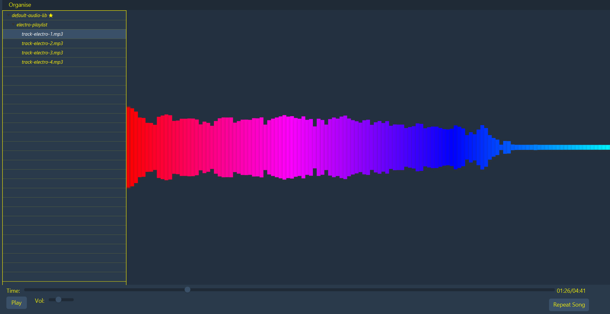
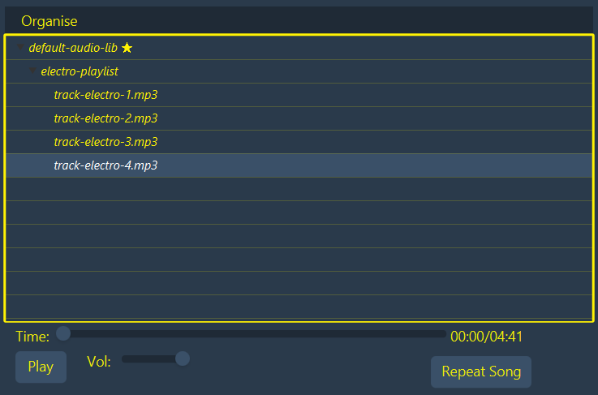

## Audio player. 

 
* User interface is minimalistic and pleasing to the eye. 
* Player includes audio visualizer.  
* UI is responsive. An audio visualizer is displayed when the application window covers more than half of the user's screen. Otherwise Audio Player will only display library/track navigation menu.

* Player includes basic functionality such as: play, stop, duration control, volume control, loop song, or play next track in the library. 
* Player provides library where you can choose audio files to play and keep track of files or playlists that are currently in play.  
* On the first startup player will create a data directory with default audio-library. User can choose different directory as library (e.g. if you already have a directory with audio files or prefer to work with audio files in different location). To change library location, you need to click on the 'organize' button and choose 'change default directory' then locate and choose your preferred directory. 

